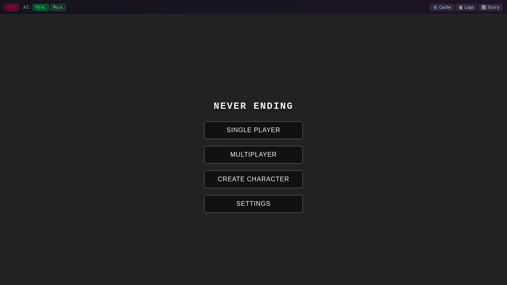
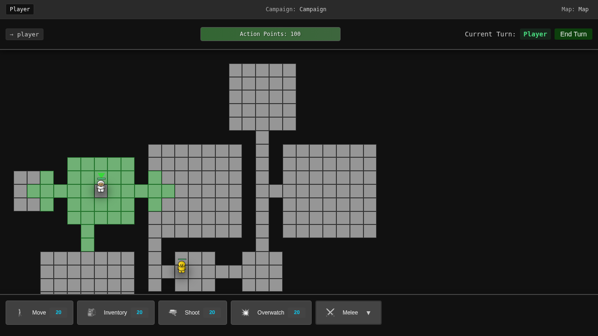

# Never Ending

A turn-based tactical strategy game featuring hexagonal grid combat, AI-powered narratives, and deep strategic gameplay. Built with TypeScript, Web Components, and an event-driven architecture.



## Overview

Never Ending is a browser-based tactical combat game where players control characters in strategic turn-based battles. The game features:

- **Hexagonal grid battlefield** with terrain and elevation
- **Action Point (AP) system** for tactical decision-making
- **Line-of-sight mechanics** for realistic combat
- **Overwatch system** for defensive positioning
- **AI-powered narrative** using Claude and OpenAI integration
- **Multiplayer support** via WebSocket connections
- **Character customization** and inventory management


## Quick Start

### Prerequisites

- Node.js (v18 or higher)
- npm (v9 or higher)

### Installation

```bash
# Clone the repository
git clone https://github.com/yourusername/never-ending.git
cd never-ending

# Install dependencies
npm install

# Start the development server
npm start
```

The game will be available at `http://localhost:3000`

## How to Play

### Basic Gameplay

1. **Start a Game**: Click "Single Player" from the main menu
2. **Control Characters**: Click on your characters (shown in your faction color)
3. **Move**: Click on highlighted hexes to move your character
4. **Actions**: Use the action bar at the bottom for combat and abilities
5. **End Turn**: Click "End Turn" when you've used your action points

### Key Mechanics

#### Action Points (AP)
- Each character starts with **100 AP** per turn
- Movement costs 10-20 AP depending on terrain
- Shooting typically costs 25 AP
- Plan your moves carefully to maximize effectiveness


#### Combat System
- **Line of Sight**: Position matters - obstacles block shots
- **Hit Probability**: Based on distance, cover, and character skills
- **Overwatch**: Set defensive positions to shoot at moving enemies
- **Cover System**: Use terrain for protection


#### Inventory & Equipment
- Manage weapons and items through the inventory system
- Equipment affects combat effectiveness
- Weight impacts movement costs


### Controls

- **Left Click**: Select/Move/Action
- **Right Click**: Cancel action
- **ESC**: Open menu/Cancel
- **Space**: End turn
- **Tab**: Cycle through characters

## Development

### Tech Stack

- **Frontend**: TypeScript, Web Components with Shadow DOM
- **Styling**: SCSS with mobile-first responsive design
- **Backend**: Express.js server with WebSocket support
- **AI Integration**: Claude API and OpenAI for narrative generation
- **Testing**: Jest for unit tests, Playwright for E2E tests
- **Build Tools**: TypeScript compiler, Sass compiler

### Architecture

The game uses an **event-driven architecture** where components communicate through a centralized EventBus:

```
User Action → Component → Event → Service → State Update → UI Update
```

Key architectural patterns:
- **Web Components** with Shadow DOM for encapsulation
- **Centralized State Management** with immutable updates
- **Service Layer** for business logic separation
- **Event-Driven Communication** for loose coupling

### Project Structure

```
never-ending/
├── src/
│   ├── components/      # Web Components (UI layer)
│   ├── common/          # Core game logic
│   │   ├── events/      # Event definitions and EventBus
│   │   └── services/    # Business logic services
│   ├── models/          # AI integrations
│   └── server/          # Express server and API
├── public/              # Compiled output
├── tutorial/            # Game documentation and images
├── e2e/                 # End-to-end tests
└── __tests__/           # Unit tests
```

### Available Scripts

```bash
# Development
npm start              # Start development environment
npm run serve          # Run server only
npm run build          # Build TypeScript
npm run sass           # Compile SCSS

# Testing
npm test               # Run unit tests
npm run test:e2e       # Run E2E tests
npm run test:e2e:ui    # E2E tests with UI
npm run test:e2e:debug # Debug E2E tests

# Code Quality
npm run check:unused   # Find unused exports
npm run check:all      # Build and check for unused code
```

### Testing

#### Unit Tests
```bash
npm test                                    # Run all tests
npm test -- corridorGenerator.test.ts      # Run specific test
```

#### E2E Tests
```bash
npm run test:e2e                           # Run all E2E tests
npm run test:e2e -- e2e/tests/basic.spec.ts # Run specific test
```

The E2E tests include automatic screenshot generation for documentation.

## Game Features

### Single Player Mode
- Campaign with AI-driven narrative
- Procedurally generated maps
- Progressive difficulty

### Multiplayer Mode
- Real-time multiplayer via WebSockets
- Create or join game rooms
- Synchronized game state


### Character Creation
- Custom character builder
- Multiple classes with unique abilities
- Stat customization


### Victory Conditions
- Eliminate all enemies
- Complete mission objectives
- Survive for specified turns



## Documentation

For detailed gameplay information, see the [tutorial documentation](tutorial/):

- [How to Play Guide](tutorial/how-to-play.md)
- [Movement Guide](tutorial/guides/movement.md)
- [Combat Guide](tutorial/guides/combat.md)
- [Overwatch Guide](tutorial/guides/overwatch.md)
- [Actions Guide](tutorial/guides/actions.md)
- [Strategy Guide](tutorial/guides/strategy.md)

## Contributing

Contributions are welcome! Please follow these guidelines:

1. Fork the repository
2. Create a feature branch (`git checkout -b feature/amazing-feature`)
3. Make your changes following the existing code style
4. Ensure all tests pass (`npm test && npm run test:e2e`)
5. Check for unused code (`npm run check:all`)
6. Commit your changes (`git commit -m 'Add amazing feature'`)
7. Push to the branch (`git push origin feature/amazing-feature`)
8. Open a Pull Request

### Code Style Guidelines

- Use TypeScript strict mode
- Follow the event-driven architecture
- Keep business logic in services, UI logic in components
- Use Shadow DOM for component encapsulation
- Write tests for new features
- Update CLAUDE.md for significant architectural changes

## System Requirements

### Minimum Requirements
- Modern web browser (Chrome, Firefox, Safari, Edge)
- JavaScript enabled
- 2GB RAM
- Stable internet connection for multiplayer

### Recommended
- Latest browser version
- 4GB+ RAM
- Hardware acceleration enabled

## License

This project is licensed under the ISC License - see the [LICENSE](LICENSE) file for details.

## Acknowledgments

- Built with TypeScript and Web Components
- AI narrative powered by Claude and OpenAI
- Special thanks to all contributors

## Support

For issues, questions, or suggestions:
- Open an issue on GitHub
- Check the [tutorial documentation](tutorial/)
- Review the [CLAUDE.md](CLAUDE.md) file for development guidance

---

Made with passion for tactical strategy gaming. Enjoy your battles in Never Ending!