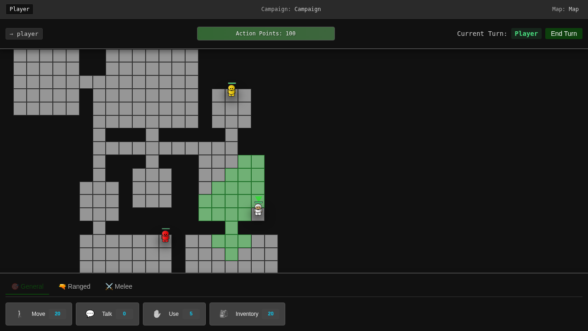

# Combat Guide

## Overview
Combat in Never Ending is a tactical, turn-based system where positioning, timing, and resource management determine victory. Every shot counts, and understanding the combat mechanics is essential for survival.


## Basic Shooting

### How to Shoot
1. **Select Shoot Action** - Open actions menu and select "Shoot"
2. **Choose Target** - Click on an enemy within range
3. **Confirm Shot** - Review hit probability and confirm
4. **Resolution** - Damage is calculated and applied

### Shooting Costs
- **Standard Shot**: 25 AP
- **Aimed Shot**: 35 AP (10 AP aim + 25 AP shoot)
- **Snap Shot**: 15 AP (reduced accuracy)
- **Burst Fire**: 40 AP (multiple projectiles)

## Line of Sight


### Understanding LOS
Line of Sight (LOS) determines what you can see and shoot:
- **Clear LOS**: Direct path to target, no obstacles
- **Partial LOS**: Some cover between you and target
- **Blocked LOS**: Cannot see or shoot target
- **Height Advantage**: Elevation improves LOS over obstacles

### LOS Indicators
- **Green Line**: Clear shot available
- **Yellow Line**: Partial cover, reduced accuracy
- **Red Line**: Shot blocked
- **Dotted Line**: Potential LOS if you move

## Hit Probability



### Factors Affecting Accuracy
Your chance to hit depends on multiple factors:

#### Distance
- **Point Blank** (1 hex): +20% accuracy
- **Close** (2-3 hexes): +10% accuracy  
- **Medium** (4-6 hexes): Base accuracy
- **Long** (7-10 hexes): -10% accuracy
- **Extreme** (11+ hexes): -25% accuracy

#### Cover
- **No Cover**: 0% modifier
- **Half Cover**: -25% to hit
- **Full Cover**: -50% to hit
- **Concealment**: Additional -10% to -20%

#### Character Stats
- **Marksmanship**: Base shooting skill
- **Weapon Skill**: Proficiency with current weapon
- **Fatigue**: Reduces accuracy over time
- **Injuries**: Wounded characters shoot less accurately

#### Environmental Factors
- **Elevation**: +10% when shooting downhill
- **Weather**: Rain/fog reduces accuracy
- **Lighting**: Night combat has penalties
- **Suppression**: Being under fire reduces accuracy

### Accuracy Calculation
```
Base Accuracy (65%)
+ Marksmanship (+15%)
+ Distance Modifier (-10%)
+ Cover Modifier (-25%)
+ Elevation Bonus (+10%)
= Final Hit Chance (55%)
```

## Damage System

### Damage Calculation
1. **Base Damage**: Determined by weapon
2. **Critical Hits**: Double damage on rolls of 95+
3. **Armor Reduction**: Reduces incoming damage
4. **Location Multiplier**: Headshots deal extra damage

### Weapon Types

#### Assault Rifles
- **Damage**: 30-40
- **Range**: Medium
- **AP Cost**: 25
- **Special**: Versatile, reliable

#### Sniper Rifles
- **Damage**: 50-70
- **Range**: Long
- **AP Cost**: 35
- **Special**: High accuracy at range

#### Shotguns
- **Damage**: 60-80
- **Range**: Short
- **AP Cost**: 20
- **Special**: Devastating up close

#### SMGs
- **Damage**: 20-30
- **Range**: Short-Medium
- **AP Cost**: 20
- **Special**: Can fire multiple times

## Combat Tactics

### Positioning for Combat
1. **Find Cover** - Always shoot from behind cover
2. **Control Range** - Fight at your weapon's optimal distance
3. **Height Advantage** - Elevated positions provide bonuses
4. **Flanking Positions** - Side shots bypass cover

### Engagement Sequence
1. **Setup** - Position and prepare
2. **Aim** - Spend AP to improve accuracy (optional)
3. **Fire** - Take your shot
4. **Reposition** - Move to avoid return fire

### Suppression
Suppression affects enemy behavior:
- Reduces enemy accuracy
- May force enemies to seek cover
- Costs ammunition but doesn't need to hit
- Useful for controlling enemy movement

## Advanced Combat Techniques

### Aimed Shots
Spending extra AP to aim provides:
- +15% accuracy per aim action
- Maximum of 2 aim actions per shot
- Cost: 10 AP per aim
- Best used for critical targets

### Reaction Fire
Save AP for defensive shooting:
- Interrupt enemy movement
- Requires reserved AP
- Lower accuracy than normal shots
- See [Overwatch Guide](overwatch.md) for details

### Focus Fire
Concentrate attacks on single targets:
- Eliminates threats faster
- Reduces enemy action economy
- Coordinate with teammates
- Priority: wounded enemies first

### Fire and Movement
Alternate shooting and repositioning:
1. Shoot from position A
2. Move to position B while enemy recovers
3. Ready to shoot again from new angle
4. Never stay static after shooting

## Combat Indicators

### Visual Feedback
- **Hit Markers**: Show successful hits
- **Damage Numbers**: Display damage dealt
- **Miss Indicators**: Show where missed shots land
- **Trajectory Lines**: Preview shot paths

### Audio Cues
- Different sounds for hits vs misses
- Armor impact sounds
- Critical hit notifications
- Weapon-specific firing sounds

## Common Combat Mistakes

1. **Shooting without aiming** - Wasting shots on low-probability attacks
2. **Ignoring cover** - Taking unnecessary damage
3. **Poor range management** - Fighting outside optimal range
4. **Tunnel vision** - Focusing on one enemy while others flank
5. **AP mismanagement** - No AP left for defensive actions

## Combat Exercises

### Exercise 1: Accuracy Training
- Take 10 shots at varying ranges
- Track hit percentage
- Goal: 70% accuracy or better
- Focus on when to aim vs shoot

### Exercise 2: Cover Drill
- Engage enemies from cover
- Never take damage during engagement
- Eliminate 3 enemies
- Reposition between each kill

### Exercise 3: Combined Arms
- Coordinate with ally
- One suppresses, one flanks
- Achieve crossfire position
- Eliminate enemy squad

## Quick Reference

| Action | AP Cost | Accuracy Modifier |
|--------|---------|------------------|
| Snap Shot | 15 | -20% |
| Normal Shot | 25 | Base |
| Aimed Shot | 35 | +15% |
| Double Aim | 45 | +30% |
| Burst Fire | 40 | -10% per shot |

## Damage Table

| Weapon Type | Damage | Optimal Range | AP Cost |
|------------|--------|---------------|---------|
| Pistol | 20-30 | Close | 20 |
| SMG | 20-30 | Short | 20 |
| Rifle | 30-40 | Medium | 25 |
| Sniper | 50-70 | Long | 35 |
| Shotgun | 60-80 | Close | 20 |

## Related Guides
- [Movement Guide](movement.md) - Positioning for combat
- [Overwatch Guide](overwatch.md) - Defensive shooting
- [Actions Guide](actions.md) - All combat actions
- [Strategy Guide](strategy.md) - Advanced combat tactics