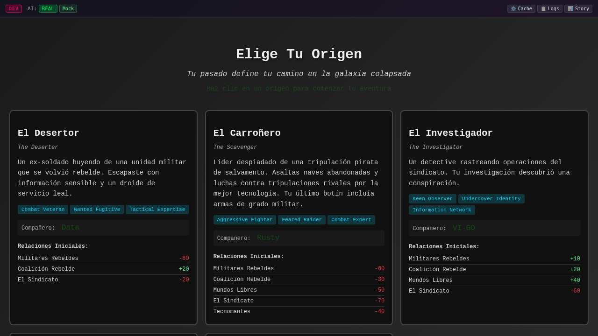
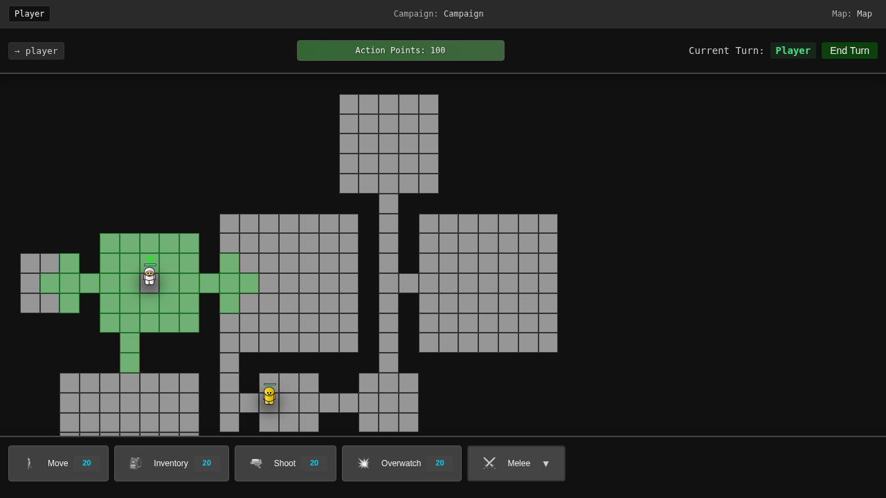

# Combat Guide

## Overview
Combat in Never Ending is a tactical, turn-based system where positioning, timing, and resource management determine victory. Whether engaging at range with firearms or up close with melee weapons, understanding the combat mechanics is essential for survival.



## Basic Shooting

### How to Shoot
1. **Select Shoot Action** - Open actions menu and select "Shoot"
2. **Choose Target** - Click on an enemy within range
3. **Confirm Shot** - Review hit probability and confirm
4. **Resolution** - Damage is calculated and applied

### Shooting Costs
- **Standard Shot**: 25 AP
- **Aimed Shot**: 35 AP (10 AP aim + 25 AP shoot)
- **Snap Shot**: 15 AP (reduced accuracy)
- **Burst Fire**: 40 AP (multiple projectiles)

## Line of Sight



### Understanding LOS
Line of Sight (LOS) determines what you can see and shoot:
- **Clear LOS**: Direct path to target, no obstacles
- **Partial LOS**: Some cover between you and target
- **Blocked LOS**: Cannot see or shoot target
- **Height Advantage**: Elevation improves LOS over obstacles

### LOS Indicators
- **Green Line**: Clear shot available
- **Yellow Line**: Partial cover, reduced accuracy
- **Red Line**: Shot blocked
- **Dotted Line**: Potential LOS if you move

## Hit Probability


### Factors Affecting Accuracy
Your chance to hit depends on multiple factors:

#### Distance
- **Point Blank** (1 hex): +20% accuracy
- **Close** (2-3 hexes): +10% accuracy  
- **Medium** (4-6 hexes): Base accuracy
- **Long** (7-10 hexes): -10% accuracy
- **Extreme** (11+ hexes): -25% accuracy

#### Cover
- **No Cover**: 0% modifier
- **Half Cover**: -25% to hit
- **Full Cover**: -50% to hit
- **Concealment**: Additional -10% to -20%

#### Character Stats
- **Marksmanship**: Base shooting skill
- **Weapon Skill**: Proficiency with current weapon
- **Fatigue**: Reduces accuracy over time
- **Injuries**: Wounded characters shoot less accurately

#### Environmental Factors
- **Elevation**: +10% when shooting downhill
- **Weather**: Rain/fog reduces accuracy
- **Lighting**: Night combat has penalties
- **Suppression**: Being under fire reduces accuracy

### Accuracy Calculation
```
Base Accuracy (65%)
+ Marksmanship (+15%)
+ Distance Modifier (-10%)
+ Cover Modifier (-25%)
+ Elevation Bonus (+10%)
= Final Hit Chance (55%)
```

## Damage System

### Damage Calculation
1. **Base Damage**: Determined by weapon
2. **Critical Hits**: Double damage on rolls of 95+
3. **Armor Reduction**: Reduces incoming damage
4. **Location Multiplier**: Headshots deal extra damage

### Weapon Types

#### Assault Rifles
- **Damage**: 30-40
- **Range**: Medium
- **AP Cost**: 25
- **Special**: Versatile, reliable

#### Sniper Rifles
- **Damage**: 50-70
- **Range**: Long
- **AP Cost**: 35
- **Special**: High accuracy at range

#### Shotguns
- **Damage**: 60-80
- **Range**: Short
- **AP Cost**: 20
- **Special**: Devastating up close

#### SMGs
- **Damage**: 20-30
- **Range**: Short-Medium
- **AP Cost**: 20
- **Special**: Can fire multiple times

## Combat Tactics

### Positioning for Combat
1. **Find Cover** - Always shoot from behind cover
2. **Control Range** - Fight at your weapon's optimal distance
3. **Height Advantage** - Elevated positions provide bonuses
4. **Flanking Positions** - Side shots bypass cover

### Engagement Sequence
1. **Setup** - Position and prepare
2. **Aim** - Spend AP to improve accuracy (optional)
3. **Fire** - Take your shot
4. **Reposition** - Move to avoid return fire

### Suppression
Suppression affects enemy behavior:
- Reduces enemy accuracy
- May force enemies to seek cover
- Costs ammunition but doesn't need to hit
- Useful for controlling enemy movement

## Melee Combat

### Overview
Close combat introduces a unique defense system where the defender actively participates in combat resolution. Success depends on predicting your opponent's moves and choosing the right defense.

### Initiating Melee Combat
1. **Select Character** - Click on your character
2. **Open Close Combat Tab** - Switch to the "CLOSE COMBAT" tab in the action menu
3. **Choose Attack Type** - Select from 6 available melee attacks
4. **Select Target** - Click on an adjacent enemy (including diagonals)
5. **Defense Phase** - Defender chooses their defense
6. **Resolution** - Damage is calculated based on attack vs defense

### Melee Attack Types
Each attack occupies a position on the defense wheel (360° circle):

#### Power Strike (0°)
- **AP Cost**: 20
- **Description**: Heavy overhead strike
- **Best Against**: Fast, light defenses
- **Weak Against**: Strong blocks

#### Slash (60°)
- **AP Cost**: 20
- **Description**: Horizontal slash
- **Best Against**: Vertical defenses
- **Weak Against**: Lateral movements

#### Fast Attack (120°)
- **AP Cost**: 15
- **Description**: Quick jab
- **Best Against**: Heavy, slow defenses
- **Weak Against**: Quick counters

#### Break Guard (180°)
- **AP Cost**: 20
- **Description**: Guard-breaking thrust
- **Best Against**: Defensive stances
- **Weak Against**: Evasive moves

#### Feint (240°)
- **AP Cost**: 15
- **Description**: Deceptive attack
- **Best Against**: Predictive defenses
- **Weak Against**: Patient guards

#### Special (300°)
- **AP Cost**: 25
- **Description**: Unique weapon technique
- **Best Against**: Standard defenses
- **Weak Against**: Specialized counters

### Defense Wheel System
When attacked in melee, the defender sees a circular wheel with 6 defense options:

#### Defense Mechanics
- **Perfect Block (0° difference)**: Same attack as defense = 0 damage
- **Good Defense (60° difference)**: Adjacent attacks = 33% damage
- **Partial Defense (120° difference)**: Two positions away = 66% damage
- **Poor Defense (180° difference)**: Opposite attack = 100% damage

#### Damage Calculation Example
```
Attacker: Power Strike (0°)
Defender Options:
- Power Strike (0°): Block - 0 damage
- Slash (60°): Good - 33% damage
- Fast Attack (120°): Partial - 66% damage
- Break Guard (180°): Poor - 100% damage
- Feint (240°): Partial - 66% damage
- Special (300°): Good - 33% damage
```

### Melee Weapons

#### Swords
- **Range**: 1-2 hexes
- **Damage**: 40-50
- **Special**: Balanced offense and defense
- **Strong vs**: Knives
- **Weak vs**: Polearms

#### Polearms
- **Range**: 2 hexes
- **Damage**: 45-55
- **Special**: Extended reach
- **Strong vs**: Swords
- **Weak vs**: Fast weapons

#### Knives
- **Range**: 1 hex
- **Damage**: 25-35
- **Special**: Fast attacks, low AP cost
- **Strong vs**: Heavy weapons
- **Weak vs**: Swords

### Unarmed Combat
Fighting without a melee weapon has severe penalties:
- **Defense Penalty**: 2x damage unless perfect block
- **Damage Output**: Minimal (5 base damage)
- **Range**: 1 hex only
- **Strategy**: Avoid melee when unarmed

### Character Rotation in Melee
- **Mouse Control**: Character faces mouse position during melee mode
- **Tactical Advantage**: Face direction affects visual clarity
- **Animation**: Smooth rotation while selecting targets
- **Exit Mode**: Returns to default facing after combat

### Melee Combat Strategy

#### Offensive Tactics
1. **Mix Attacks**: Don't be predictable
2. **AP Management**: Save AP for follow-up attacks
3. **Weapon Advantage**: Exploit weapon type advantages
4. **Range Control**: Use polearm reach when available

#### Defensive Tactics
1. **Read Patterns**: Observe enemy attack preferences
2. **Risk Assessment**: Sometimes taking partial damage is acceptable
3. **Counter Logic**: Think about what opponent expects
4. **Weapon Awareness**: Know enemy weapon capabilities

### Multiplayer Melee Combat
In multiplayer games:
- **Defense Wheel**: Only appears on defender's screen
- **Time Limit**: Defender has limited time to choose
- **Network Sync**: All actions synchronized in real-time
- **Mind Games**: Psychology becomes crucial

### Melee Combat Indicators
- **Target Highlights**: Valid melee targets glow
- **Range Indicators**: Shows melee weapon reach
- **Damage Preview**: Defense wheel shows potential damage
- **Combat Resolution**: Damage numbers and animations

## Advanced Combat Techniques

### Aimed Shots
Spending extra AP to aim provides:
- +15% accuracy per aim action
- Maximum of 2 aim actions per shot
- Cost: 10 AP per aim
- Best used for critical targets

### Reaction Fire
Save AP for defensive shooting:
- Interrupt enemy movement
- Requires reserved AP
- Lower accuracy than normal shots
- See [Overwatch Guide](overwatch.md) for details

### Focus Fire
Concentrate attacks on single targets:
- Eliminates threats faster
- Reduces enemy action economy
- Coordinate with teammates
- Priority: wounded enemies first

### Fire and Movement
Alternate shooting and repositioning:
1. Shoot from position A
2. Move to position B while enemy recovers
3. Ready to shoot again from new angle
4. Never stay static after shooting

## Combat Indicators

### Visual Feedback
- **Hit Markers**: Show successful hits
- **Damage Numbers**: Display damage dealt
- **Miss Indicators**: Show where missed shots land
- **Trajectory Lines**: Preview shot paths

### Audio Cues
- Different sounds for hits vs misses
- Armor impact sounds
- Critical hit notifications
- Weapon-specific firing sounds

## Common Combat Mistakes

1. **Shooting without aiming** - Wasting shots on low-probability attacks
2. **Ignoring cover** - Taking unnecessary damage
3. **Poor range management** - Fighting outside optimal range
4. **Tunnel vision** - Focusing on one enemy while others flank
5. **AP mismanagement** - No AP left for defensive actions

## Combat Exercises

### Exercise 1: Accuracy Training
- Take 10 shots at varying ranges
- Track hit percentage
- Goal: 70% accuracy or better
- Focus on when to aim vs shoot

### Exercise 2: Cover Drill
- Engage enemies from cover
- Never take damage during engagement
- Eliminate 3 enemies
- Reposition between each kill

### Exercise 3: Combined Arms
- Coordinate with ally
- One suppresses, one flanks
- Achieve crossfire position
- Eliminate enemy squad

## Quick Reference

### Ranged Combat
| Action | AP Cost | Accuracy Modifier |
|--------|---------|------------------|
| Snap Shot | 15 | -20% |
| Normal Shot | 25 | Base |
| Aimed Shot | 35 | +15% |
| Double Aim | 45 | +30% |
| Burst Fire | 40 | -10% per shot |

### Melee Combat
| Attack | AP Cost | Angle | Defense Strategy |
|--------|---------|-------|-----------------|
| Power Strike | 20 | 0° | Block with same or dodge with Feint/Special |
| Slash | 20 | 60° | Block with same or dodge with Break Guard |
| Fast Attack | 15 | 120° | Block with same or dodge with Feint |
| Break Guard | 20 | 180° | Block with same or dodge with Power Strike |
| Feint | 15 | 240° | Block with same or dodge with Fast Attack |
| Special | 25 | 300° | Block with same or dodge with Slash |

## Damage Table

### Ranged Weapons
| Weapon Type | Damage | Optimal Range | AP Cost |
|------------|--------|---------------|---------|
| Pistol | 20-30 | Close | 20 |
| SMG | 20-30 | Short | 20 |
| Rifle | 30-40 | Medium | 25 |
| Sniper | 50-70 | Long | 35 |
| Shotgun | 60-80 | Close | 20 |

### Melee Weapons
| Weapon Type | Damage | Range | Special |
|------------|--------|-------|---------|
| Sword | 40-50 | 1-2 hex | Balanced |
| Polearm | 45-55 | 2 hex | Extended reach |
| Knife | 25-35 | 1 hex | Fast, low AP |
| Unarmed | 5 | 1 hex | 2x damage taken |

## Related Guides
- [Movement Guide](movement.md) - Positioning for combat
- [Overwatch Guide](overwatch.md) - Defensive shooting
- [Actions Guide](actions.md) - All combat actions
- [Strategy Guide](strategy.md) - Advanced combat tactics