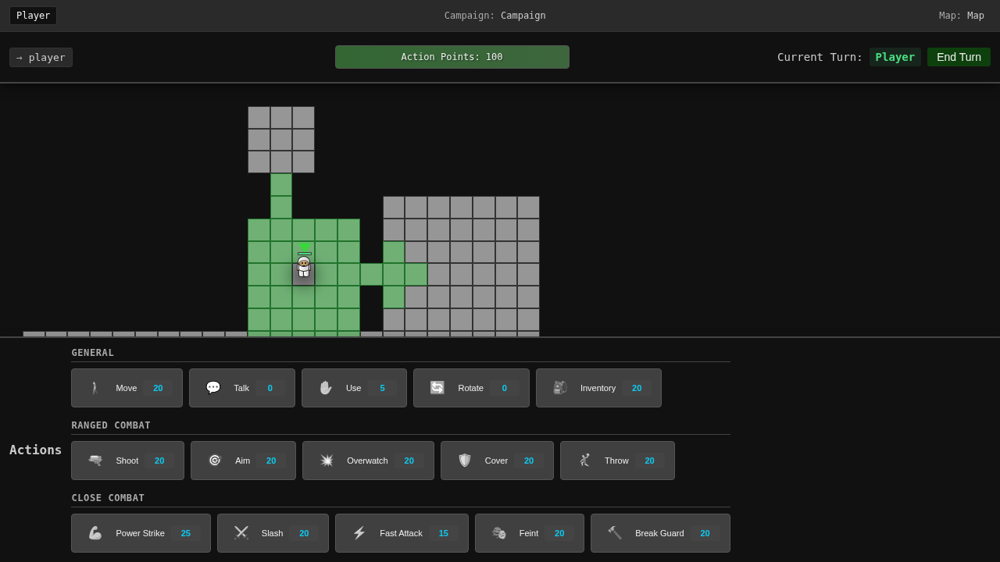

# Overwatch Guide

## Overview
Overwatch is a defensive action that allows your characters to automatically shoot at enemies who move within their line of sight. It's a powerful tool for area denial and protecting key positions.

## What is Overwatch?

Overwatch puts your character in a defensive stance where they will:
- Monitor a specific area or direction
- Automatically shoot at enemies who enter their field of view
- React to enemy movement during the enemy's turn
- Provide covering fire for allies

## Setting Up Overwatch

### How to Activate
1. **Open Actions Menu** - Click the Actions button
2. **Select Overwatch** - Choose from available actions
3. **Choose Coverage Area** - Select direction or cone to watch
4. **Confirm** - Your character enters overwatch stance

### Overwatch Cost
- **Standard Overwatch**: 30 AP
- **Focused Overwatch**: 40 AP (narrower cone, better accuracy)
- **360° Overwatch**: 50 AP (covers all directions, reduced accuracy)

## Overwatch Mechanics

### Trigger Conditions
Overwatch fires when:
- Enemy enters your field of view
- Enemy moves within your coverage area
- Enemy performs hostile action in view
- Ally requests covering fire (faction overwatch)

### Coverage Areas

#### Cone Coverage (Default)
- **Arc**: 90-degree cone
- **Range**: Your weapon's effective range
- **Accuracy**: Normal shooting accuracy
- **Best for**: Watching specific approaches

#### Focused Coverage
- **Arc**: 45-degree cone
- **Range**: Extended by 2 hexes
- **Accuracy**: +10% bonus
- **Best for**: Long corridors, choke points

#### 360° Coverage
- **Arc**: All directions
- **Range**: Reduced by 2 hexes
- **Accuracy**: -15% penalty
- **Best for**: Open areas, last stands

### Overwatch Priority
When multiple enemies trigger overwatch:
1. **Closest enemy** fires first
2. **Most threatening** (armed enemies prioritized)
3. **Fastest moving** (sprinting enemies)
4. **First to enter** (if all else equal)

## Overwatch Tactics

### Defensive Positions

#### Chokepoint Control
Set up overwatch at narrow passages:
- Enemies must pass through kill zone
- Multiple overwatches create crossfire
- Cannot be easily flanked
- Maximum effectiveness with minimum AP

#### High Ground Overwatch
Elevated positions provide:
- Extended line of sight
- Better coverage area
- Harder to suppress
- Natural cover advantage

#### Interlocking Fields
Multiple characters in overwatch:
- Cover each other's blind spots
- Create no-go zones for enemies
- Force enemies into specific paths
- Multiply defensive firepower

### Offensive Overwatch

#### Bounding Overwatch
Advancing with cover:
1. Character A sets overwatch
2. Character B advances
3. Character B sets overwatch
4. Character A advances past B
5. Repeat pattern

#### Suppressive Overwatch
Pin enemies in place:
- Set overwatch on enemy cover
- Enemy cannot move without taking fire
- Teammate flanks pinned enemy
- Coordinate for maximum effect

## Advanced Overwatch Techniques

### Overwatch Traps
Create kill zones:
1. **Bait** - Show vulnerable target
2. **Channel** - Force enemy movement path
3. **Spring** - Multiple overwatches trigger
4. **Eliminate** - Concentrated fire destroys enemy

### Delayed Overwatch
Save overwatch for critical moment:
- Don't set immediately
- Wait for enemy commitment
- Activate when most effective
- Catch enemies in the open

### Overwatch Chains
Sequential coverage:
- First overwatch forces enemy to cover
- Second overwatch covers that position
- Third overwatch prevents retreat
- Creates inescapable situation

## Countering Overwatch

### Breaking Overwatch
Enemy overwatch can be defeated by:
- **Suppression** - Fire at overwatch position
- **Smoke** - Block line of sight
- **Flanking** - Attack from outside coverage
- **Grenades** - Force them to move
- **Sacrificial movement** - Trigger with expendable unit

### Overwatch Indicators
Recognize enemy overwatch:
- Character stance changes
- Visual cone indicators (if visible)
- Weapon pointed at specific area
- Defensive positioning

## Overwatch Efficiency

### AP Management
- **Early Turn**: Set overwatch with high AP characters
- **Mid Turn**: Overwatch after key movements
- **Late Turn**: Always consider overwatch vs other actions
- **Reserve**: Keep 30 AP minimum for overwatch option

### Success Factors
Overwatch effectiveness depends on:
- **Position Quality**: Cover and sight lines
- **Weapon Type**: Automatic weapons excel
- **Character Skills**: Reflexes and awareness
- **Enemy Predictability**: Known movement patterns

## Common Overwatch Mistakes

1. **Poor positioning** - Overwatch from exposed locations
2. **Wrong coverage** - Watching low-traffic areas
3. **Premature trigger** - Wasting on non-threats
4. **No coordination** - Overlapping coverage areas
5. **Forgetting overwatch** - Not using this powerful tool

## Overwatch Scenarios

### Scenario 1: Hallway Defense
- Long corridor with single approach
- Set focused overwatch down hallway
- Teammate covers perpendicular routes
- Enemy must brave kill zone or find alternate path

### Scenario 2: Extraction Coverage
- Faction needs to retreat
- Rear guard sets 360° overwatch
- Faction moves to safety
- Overwatch character withdraws last

### Scenario 3: Ambush Setup
- Multiple overwatch positions prepared
- Enemy lured into kill zone
- All overwatch triggers simultaneously
- Devastating concentrated fire

## Quick Reference

| Overwatch Type | AP Cost | Coverage | Accuracy |
|---------------|---------|----------|----------|
| Standard | 30 | 90° cone | Normal |
| Focused | 40 | 45° cone | +10% |
| Wide | 35 | 120° cone | -5% |
| 360° | 50 | All directions | -15% |

## Overwatch Effectiveness

| Position | Effectiveness | Why |
|----------|--------------|-----|
| High Ground | Excellent | Better LOS, harder to flank |
| Chokepoint | Excellent | Forced enemy movement |
| Corner | Good | Natural cover, limited angles |
| Open Ground | Poor | Exposed, easy to suppress |
| Behind Cover | Good | Protected, sustainable |

## Related Guides
- [Combat Guide](combat.md) - Shooting mechanics
- [Movement Guide](movement.md) - Positioning for overwatch
- [Actions Guide](actions.md) - All defensive actions
- [Strategy Guide](strategy.md) - Advanced overwatch tactics