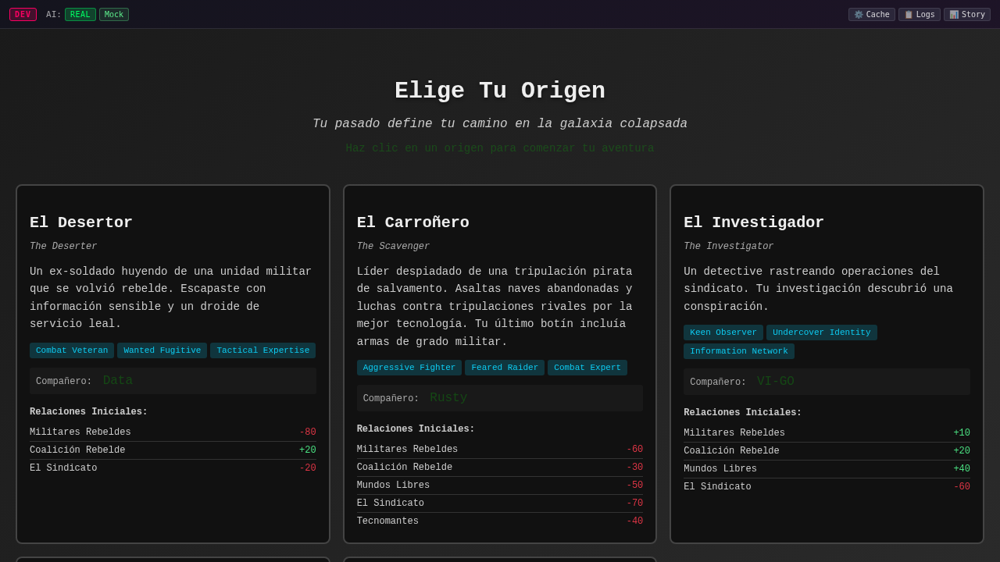

# Strategy Guide

## Overview
Success in Never Ending requires more than understanding individual mechanics. This guide covers advanced strategies, faction tactics, and the decision-making that separates good players from great ones.


## Core Strategic Principles

### Action Economy
The faction that takes more effective actions wins:
- **Eliminate enemies** reduces their actions
- **Preserve characters** maintains your actions
- **Efficient AP usage** maximizes actions per turn
- **Force inefficiency** make enemies waste AP

### Positioning Over Firepower
Good positioning beats superior weapons:
- Control key terrain
- Maintain sight lines
- Deny enemy movement
- Create kill zones

### Information Warfare
Knowledge is power:
- Scout before committing
- Track enemy AP usage
- Predict enemy movements
- Hide your intentions

## Opening Strategies

### Aggressive Opening
Rush to control center map:
1. Sprint key characters forward
2. Secure dominant positions
3. Set up overwatch net
4. Force enemy to react

**Pros**: Map control, initiative
**Cons**: AP intensive, risky

### Defensive Opening
Establish strong defensive line:
1. Take nearest good cover
2. Set up interlocking overwatch
3. Wait for enemy approach
4. Counter-attack when they're exposed

**Pros**: Safe, AP efficient
**Cons**: Gives up map control

### Balanced Opening
Controlled advance:
1. Move up systematically
2. Always maintain overwatch
3. Secure position before advancing
4. Probe for enemy positions

**Pros**: Flexible, sustainable
**Cons**: Slower to develop

## Mid-Game Strategies

### Flanking Maneuvers


Execute pincer attacks:
1. **Pin**: Fix enemy with suppression
2. **Flank**: Send unit around side
3. **Pressure**: Force enemy to choose
4. **Execute**: Attack from multiple angles

### Attrition Warfare
Wear down enemy systematically:
- Focus fire to eliminate units
- Trade favorably (their AP for yours)
- Control medical supplies
- Preserve your force strength

### Breakthrough Tactics
Punch through enemy lines:
1. Identify weak point
2. Concentrate firepower
3. Rush through gap
4. Exploit confusion

## Advanced Tactics

### The Kill Box
Create inescapable death zones:
1. **Channel** enemy movement
2. **Position** multiple overwatches
3. **Trigger** when enemy commits
4. **Eliminate** with concentrated fire

### Bait and Switch
Lure enemies into traps:
1. Show "vulnerable" unit
2. Enemy moves to attack
3. Hidden units reveal
4. Ambush from multiple angles

### Rolling Thunder
Continuous offensive pressure:
1. First wave attacks and withdraws
2. Second wave immediately follows
3. No time for enemy to recover
4. Maintain constant pressure

### Fortress Defense
Impregnable defensive position:
- Multiple layers of overwatch
- Overlapping fields of fire
- Protected flanks
- Reserve force ready

## Faction Compositions

### Balanced Faction
- 2 Assault (versatile damage)
- 1 Sniper (long range elimination)
- 1 Support (healing/utility)
- **Strategy**: Flexible, any situation

### Rush Faction
- 3 Assault (maximum firepower)
- 1 Scout (speed and recon)
- **Strategy**: Aggressive, fast victories

### Defensive Faction
- 1 Sniper (long range)
- 2 Heavy (tankiness)
- 1 Support (sustainability)
- **Strategy**: Attrition, outlast enemy

### Specialist Faction
- 4 unique specialized roles
- **Strategy**: Specific tactics
- **Risk**: Less flexibility

## Resource Management

### AP Economy
Maximize AP value:
- **High value targets** first
- **Efficient movement** paths
- **Reserve for reactions**
- **Don't waste on low%** shots

### Ammunition Control
Manage limited ammo:
- Count shots remaining
- Reload during safe moments
- Carry backup weapons
- Share ammo with faction

### Medical Supplies
Preserve healing items:
- Use cover to avoid damage
- Heal only when critical
- Share healing items
- Protect the medic

## Psychological Warfare

### Intimidation Tactics
Break enemy morale:
- Eliminate leaders first
- Devastating alpha strikes
- Control escape routes
- Display overwhelming force

### Deception
Mislead the enemy:
- False movements
- Decoy positions
- Hidden reserves
- Feigned retreats

### Pressure Points
Apply maximum stress:
- Time pressure (objectives)
- Multiple threats
- Force difficult decisions
- Exploit mistakes immediately

## Common Strategic Mistakes

### Tactical Errors
1. **Overextension** - Advancing too far
2. **Poor focus fire** - Spreading damage
3. **AP waste** - Inefficient actions
4. **Predictability** - Same tactics repeatedly
5. **Tunnel vision** - Ignoring flanks

### Strategic Errors
1. **No plan** - Acting without purpose
2. **Inflexibility** - Not adapting
3. **Poor timing** - Acting too early/late
4. **Resource waste** - Using items poorly
5. **Position abandonment** - Giving up good spots

## Situational Strategies

### Outnumbered
When facing superior numbers:
- Use chokepoints
- Force 1v1 engagements
- Hit and run tactics
- Psychological pressure

### Outgunned
Against superior weapons:
- Close distance quickly
- Use smoke and cover
- Flank attacks
- Ambush tactics

### Defending Objectives
Holding specific locations:
- Layered defense
- Mobile reserve
- Counter-attack ready
- Time management

### Assault Objectives
Taking enemy positions:
- Smoke approach
- Multiple angles
- Suppress defenders
- Speed and violence

## Victory Conditions

### Elimination
Destroy all enemies:
- Focus fire priority targets
- Preserve your force
- Control engagement range
- Deny enemy healing

### Survival
Last specified turns:
- Maximum defense
- Time wasting tactics
- Force enemy mistakes
- Preserve resources

### Objective Control
Hold/capture points:
- Speed vs security
- Area denial
- Mobile defense
- Time management

## Training Exercises

### Exercise 1: 2v4 Defense
- You have 2 units vs 4 enemies
- Survive 5 turns
- Use terrain and overwatch
- Focus: Defensive tactics

### Exercise 2: Speed Run
- Reach objective in 3 turns
- Multiple enemy positions
- Limited AP per turn
- Focus: Efficiency

### Exercise 3: Perfect Victory
- Win without taking damage
- Full enemy squad
- No item use
- Focus: Positioning

## Quick Strategy Reference

| Situation | Strategy | Key Actions |
|-----------|----------|-------------|
| Outnumbered | Defensive | Chokepoints, overwatch |
| Advantage | Aggressive | Push, eliminate quickly |
| Unknown | Cautious | Scout, probe, adapt |
| Stalemate | Flanking | Create new angles |
| Desperate | All-in | Maximum risk/reward |

## Tactical Decision Tree

```
Enemy Visible?
├─ Yes
│  ├─ Can eliminate? → Focus fire
│  ├─ Can damage? → Shoot if >60%
│  └─ Too risky? → Reposition
└─ No
   ├─ Good position? → Overwatch
   ├─ Poor position? → Move to cover
   └─ Objective nearby? → Advance
```

## Related Guides
- [Movement Guide](movement.md) - Positioning basics
- [Combat Guide](combat.md) - Engagement tactics
- [Overwatch Guide](overwatch.md) - Defensive strategies
- [Actions Guide](actions.md) - Action efficiency