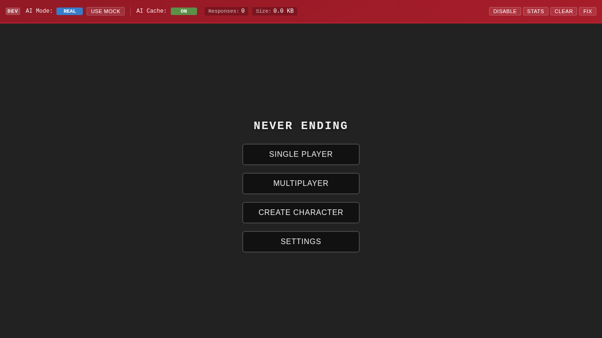
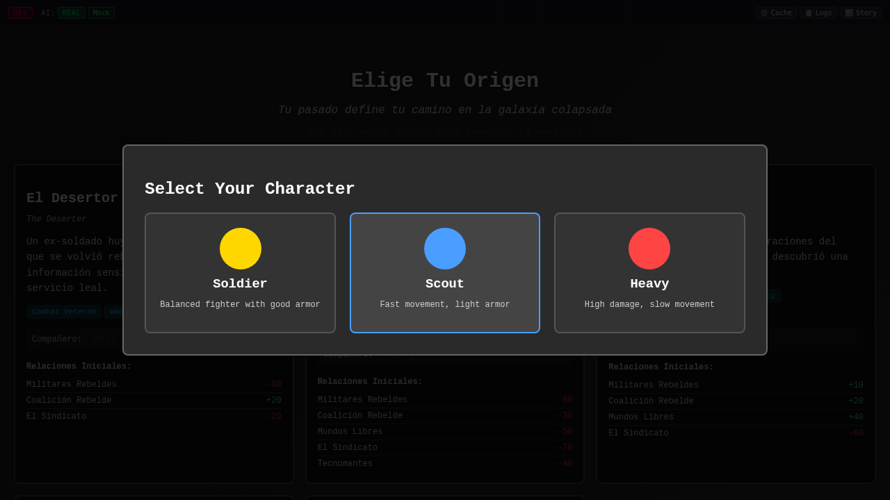

# How to Play Never Ending

Welcome to Never Ending, a turn-based strategy game where you control characters in tactical combat. This tutorial will guide you through the basics of playing the game.

## Table of Contents
1. [Getting Started](#getting-started)
2. [Game Interface](#game-interface)
3. [Game Concepts](#game-concepts)
4. [Movement and Actions](#movement-and-actions)
5. [Combat](#combat)
6. [Strategy Tips](#strategy-tips)

## In-Depth Guides
For detailed information on specific game mechanics:
- 📍 **[Movement Guide](guides/movement.md)** - Master positioning and terrain
- ⚔️ **[Combat Guide](guides/combat.md)** - Shooting mechanics and damage
- 🛡️ **[Overwatch Guide](guides/overwatch.md)** - Defensive tactics and area control
- 🎮 **[Actions Guide](guides/actions.md)** - Complete list of all actions and AP costs
- 🧠 **[Strategy Guide](guides/strategy.md)** - Advanced tactics and team compositions

## Getting Started

When you first launch Never Ending, you'll see the main menu screen:

From here you can:
- **Play**: Start a single player game
- **Multiplayer**: Join or create multiplayer games (requires server connection)
- **Character Creator**: Create custom characters

Click the **"Play"** button to start a new game.

### Character Selection

After starting a game, you'll need to select your character:

Choose from different character classes, each with unique abilities and stats.

## Game Interface

Once in the game, you'll see the main game interface:

The game interface consists of:
- **Game Board**: The hexagonal grid where characters move and fight
- **Characters**: Represented as circular icons on the board
- **Top Bar**: Shows game information and settings
- **Bottom Bar**: Contains action buttons and turn controls

## Game Concepts

### Action Points (AP)
Every turn, you have **100 Action Points** to spend on various actions:
- **Movement**: Costs 10-20 AP per hex depending on terrain
- **Shooting**: Typically costs 25 AP
- **Aiming**: Costs 10 AP to improve accuracy
- **Other Actions**: Various costs for special abilities

### Turn-Based Combat
- Each player takes turns controlling their characters
- Plan your moves carefully to maximize your AP usage
- Turns end when you click "End Turn" or run out of AP

### Line of Sight
- You need clear line of sight to shoot at enemies
- Obstacles and terrain can block shots
- Position matters for both offense and defense

## Movement and Actions

### Moving Characters
1. Click on your character to select them
2. Click on a destination hex to move
3. Valid movement paths will be highlighted
4. Movement cost is deducted from your AP

### Available Actions
Actions vary based on your character and equipment:
- **Move**: Basic movement across the battlefield
- **Sprint**: Faster movement that costs more AP
- **Shoot**: Fire at enemies within range
- **Aim**: Improve accuracy before shooting
- **Overwatch**: Set up defensive fire position
- **Melee Attack**: Close combat strikes

## Combat

### Shooting Mechanics
1. Select the "Shoot" action
2. Choose your target
3. The game calculates hit probability based on:
   - Distance to target
   - Cover and obstacles
   - Character skills
   - Previous aiming actions

### Tactical Considerations
- **Cover**: Always try to end turns behind cover
- **Flanking**: Attack enemies from multiple angles
- **AP Management**: Save some AP for defensive actions
- **Range**: Different weapons have different effective ranges

## Strategy Tips

### Basic Strategy
1. **Control the High Ground**: Height advantage improves shooting
2. **Use Cover Effectively**: Minimize exposure to enemy fire
3. **Coordinate Attacks**: Focus fire on single targets
4. **Manage Resources**: Don't waste all AP on movement

### Advanced Tactics
- **Overwatch Traps**: Set up crossfire zones (see [Overwatch Guide](guides/overwatch.md))
- **Flanking Maneuvers**: Force enemies out of cover (see [Movement Guide](guides/movement.md))
- **AP Conservation**: Save AP for reaction shots (see [Actions Guide](guides/actions.md))
- **Terrain Usage**: Use obstacles to block enemy movement

For comprehensive strategy information, read the **[Complete Strategy Guide](guides/strategy.md)**.

## Controls

### Keyboard Shortcuts
- **ESC**: Pause/Menu
- **Space**: End Turn
- **Tab**: Cycle through characters

### Mouse Controls
- **Left Click**: Select/Move/Action
- **Right Click**: Cancel action
- **Scroll**: Zoom in/out (if available)

## Victory Conditions

Win battles by:
- Eliminating all enemy forces
- Completing mission objectives
- Surviving for the required turns

## Getting Help

- The game includes tooltips for most UI elements
- Hover over buttons and actions for more information
- Check the settings menu for additional options

---

Good luck on the battlefield! Remember, tactical thinking and careful planning are the keys to victory in Never Ending.